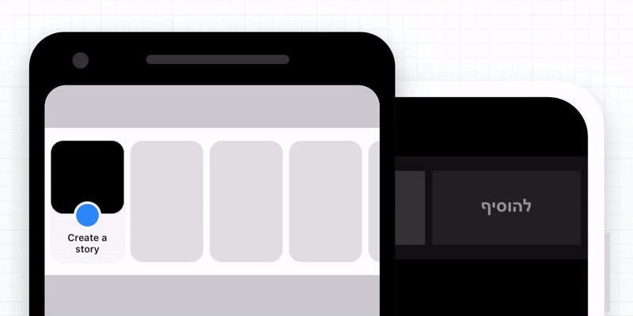

<div align="center">
<h1>Sticky Item</h1>

[](https://www.npmjs.com/package/@gorhom/sticky-item) [](https://www.npmjs.com/package/@gorhom/sticky-item) [](https://www.npmjs.com/package/@gorhom/sticky-item)



An interactive sticky item inspired by Facebook Stories.

</div>

---

## Installation

```sh
yarn add @gorhom/sticky-item
# or
npm install @gorhom/sticky-item
```

> Also, you need to install [react-native-reanimated](https://github.com/software-mansion/react-native-reanimated), [react-native-gesture-handler](https://github.com/software-mansion/react-native-gesture-handler) & [react-native-svg](https://github.com/react-native-community/react-native-svg), and follow theirs installation instructions.

## Usage

```tsx
...
import StickyItemFlatList from '@gorhom/sticky-item';

// dummy data
const data = [...Array(20)]
  .fill(0)
  .map((_, index) => ({ id: `item-${index}` }));

// configs
const ITEM_WIDTH = 90;
const ITEM_HEIGHT = 150;
const STICKY_ITEM_WIDTH = 24;
const STICKY_ITEM_HEIGHT = 24;
const STICKY_ITEM_BACKGROUNDS = ['#222', '#000'];
const SEPARATOR_SIZE = 8;
const BORDER_RADIUS = 10;

const StickyItemView = ({
  x,
  threshold,
  itemWidth,
  itemHeight,
  stickyItemWidth,
  stickyItemHeight,
  separatorSize,
  isRTL,
}) => {

  const amazingAnimation = {
    // here you add your custom interactive animation
    // based on the animated value `x`
  }

  return <Animated.View style={amazingAnimation} />
}

const App = () => {
  // methods
  const handleStickyItemPress = () => Alert.alert('Sticky Item Pressed');

  // render
  const renderItem = ({ item, index}) => (
    <View
      key={`item-${index}`}
      style={{
        backgroundColor: 'red',
        width: ITEM_WIDTH,
        height: ITEM_HEIGHT,
      }}
    />
  )
  return (
    <StickyItemFlatList
      itemWidth={ITEM_WIDTH}
      itemHeight={ITEM_HEIGHT}
      separatorSize={SEPARATOR_SIZE}
      borderRadius={BORDER_RADIUS}
      stickyItemWidth={STICKY_ITEM_WIDTH}
      stickyItemHeight={STICKY_ITEM_HEIGHT}
      stickyItemBackgroundColors={STICKY_ITEM_BACKGROUNDS}
      stickyItemContent={StickyItemView}
      onStickyItemPress={handleStickyItemPress}
      data={data}
      renderItem={renderItem}
    />
  )
}

export default App
```

## Props

| name                         | description                                                                                                   | required | type                                                | default |
| ---------------------------- | ------------------------------------------------------------------------------------------------------------- | -------- | --------------------------------------------------- | ------- |
| `itemWidth`                  | Item's width.                                                                                                 | YES      | number                                              |         |
| `itemHeight`                 | Item's height.                                                                                                | YES      | number                                              |         |
| `separatorSize`              | FlatList's separator width, \* if you provide `ItemSeparatorComponent`, you will need to set `separatorSize`. | NO\*     | number                                              | 10      |
| `borderRadius`               | Item & sticky border radius.                                                                                  | NO       | number                                              | 15      |
| `stickyItemActiveOpacity`    | Sticky item's active opacity.                                                                                 | YES      | number                                              | 0.25    |
| `stickyItemWidth`            | Sticky item's width.                                                                                          | YES      | number                                              |         |
| `stickyItemHeight`           | Sticky item's height.                                                                                         | YES      | number                                              |         |
| `stickyItemBackgroundColors` | Sticky item's two background colors, one when sticky item is extended another when it's minimize.             | YES      | string[]                                            |         |
| `stickyItemContent`          | Sticky item's content component.                                                                              | YES      | [`ReactNode`](./src/types.ts#L30)                   |         |
| `isRTL`                      | FlatList' layout direction.                                                                                   | NO       | boolean                                             | false   |
| `onStickyItemPress`          | Callback when sticky item gets pressed.                                                                       | NO       | function                                            |         |
| `...FlatList Props`          | React Native FlatList props.                                                                                  | NO       | [`FlatList`](https://reactnative.dev/docs/flatlist) |         |

## To Do

- [ ] Write a detailed step-by-step instruction to create sticky interactive animation.
- [ ] Add more examples.
- [ ] Add vertical support ?.

<h2 id="built-with">Built With ❤️</h2>

- [react-native-reanimated](https://github.com/software-mansion/react-native-reanimated)
- [react-native-gesture-handler](https://github.com/software-mansion/react-native-gesture-handler)
- [react-native-redash](https://github.com/wcandillon/react-native-redash)
- [react-native-svg](https://github.com/react-native-community/react-native-svg)
- [@react-native-community/bob](https://github.com/react-native-community/bob)

## Author

- [Mo Gorhom](https://twitter.com/gorhom)

## License

MIT

<div align="center">

Liked the library? 😇

<a href="https://www.buymeacoffee.com/gorhom" target="_blank"></a>

</div>

---

<p align="center">
<a href="https://twitter.com/gorhom"></a>
</p>
